# Recipe Box

React Native Recipe app for cooking at home or other places.


## API Reference

- API used for this app are derived from https://www.themealdb.com/api.php


## Authors

- [@chitkoo](https://github.com/chitkoo)


## Deployment

To deploy this project run

```bash
  npm install
  
  npx react-native run-android
```
- if get stuck at mmkv:boostdownload, please use vpn.

## Features

- Redux states are persisted!
- Save/unsave your favourite recipes
- Search recipes
- Linked with youtube ( watch recipe process )
- Create / Read / Update / Delete your own recipe
- Upload recipe photo
- English / Myanmar language
- Fullscreen mode
- Cross platform


## Feedback

If you have any feedback, please reach out to me at chitkokooo196@.com


## 🚀 About Me
I'm a Junior React Native developer...


# Hi, I'm Chit Ko! 👋


## 🔗 Links

[](https://www.linkedin.com/in/chit-ko-92a8921ab/)
[](https://t.me/chitkodev)
[](https://www.facebook.com/ck.chitkoxx/)

## Currently

👩‍💻 I'm currently learning react-native-firebase

👯‍♀️ I'm looking for junior react native developer position


## 🛠 Skills
React Native, Redux, React, React Navigation v6, MMKV Storage, Cryptojs, JavaScript, Html, Css 


## Screenshots


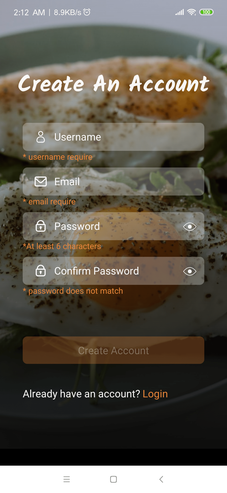
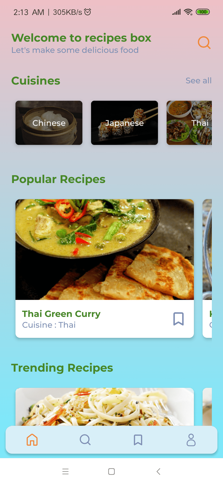
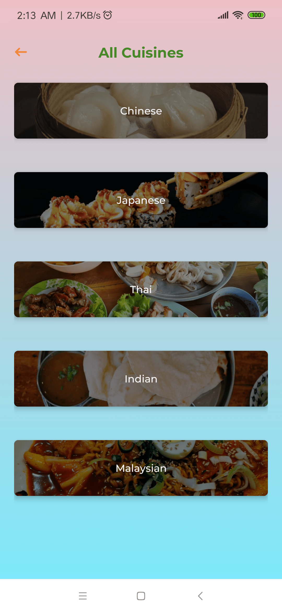
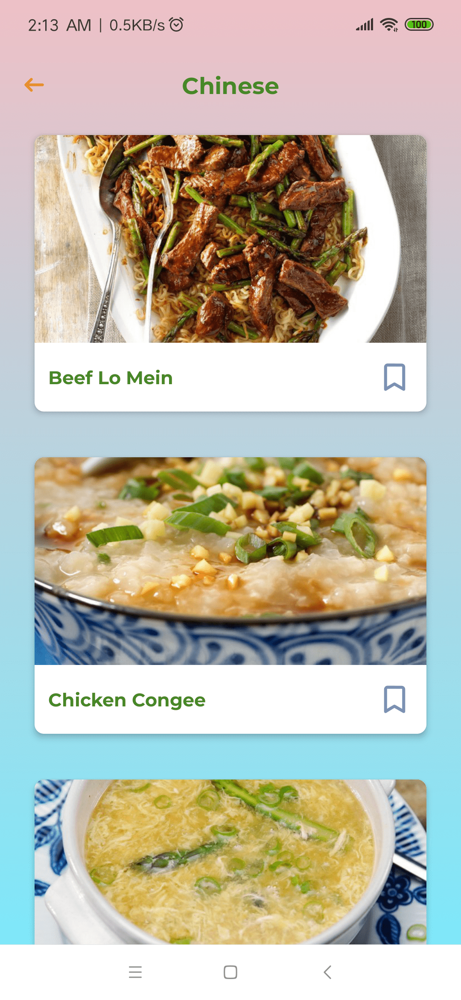
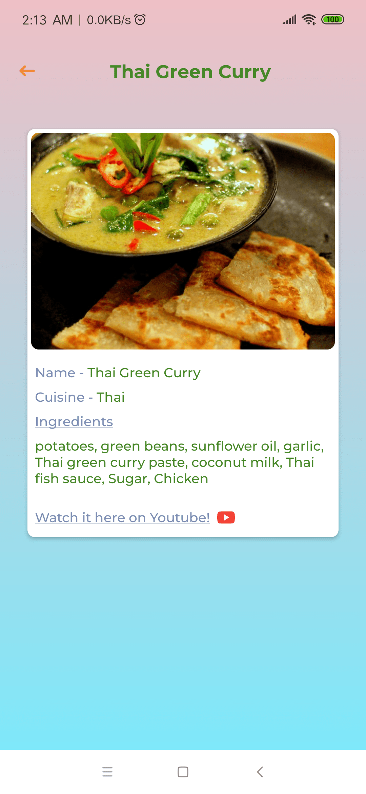
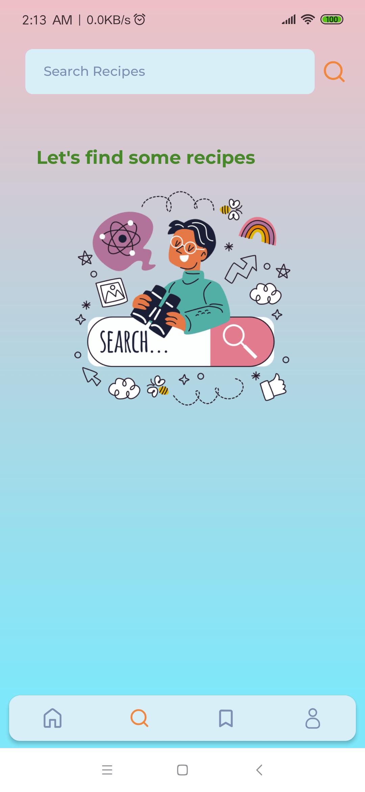
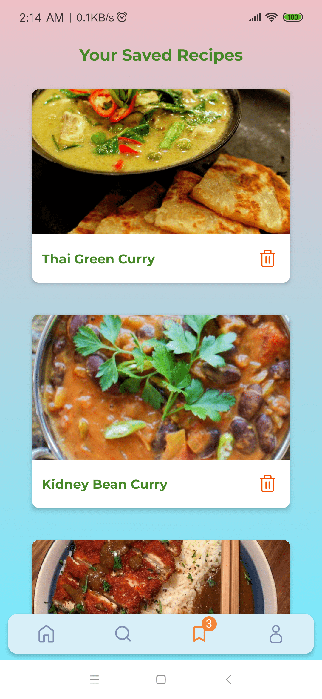
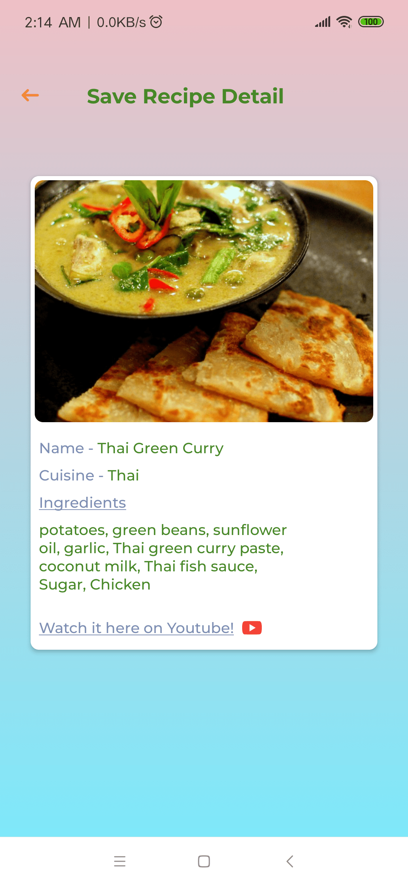
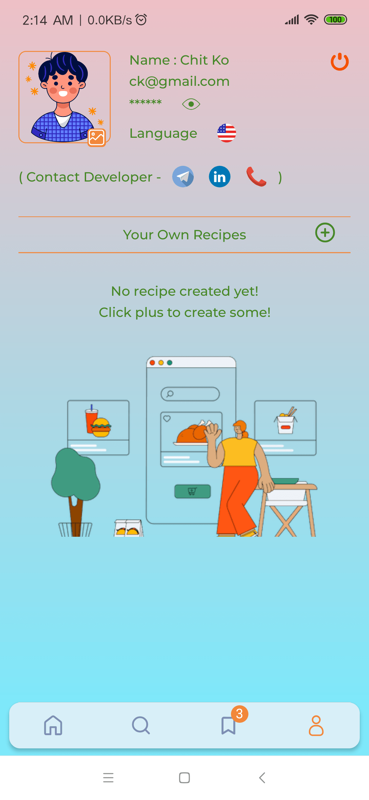
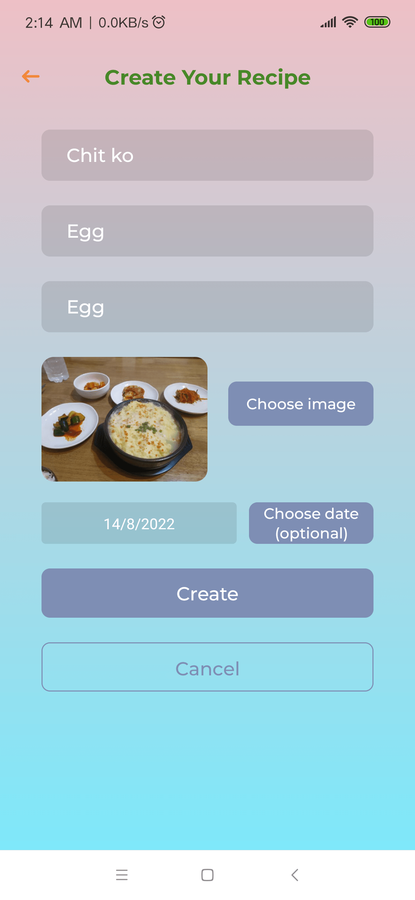
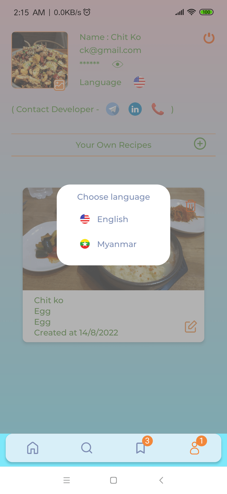
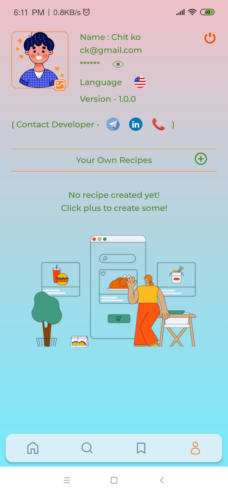
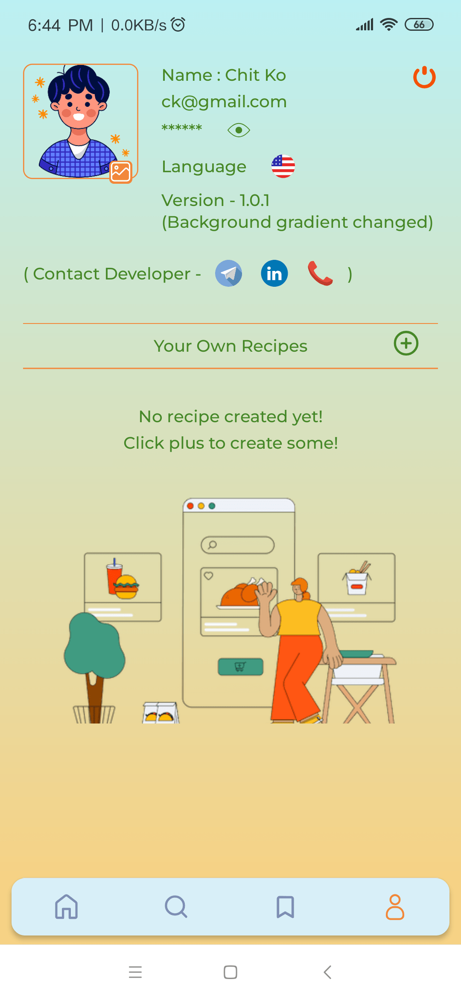
## Tech Stack

**Client:** React Native, @reduxjs/toolkit, @shopify/flash-list, @react-navigation, redux-persist, react-native-reanimated and others . . . 

**Server:** MMKV Local Storage

